# Job Site Platform - System Architecture and Workflow

## System Overview

The Job Site is a comprehensive job marketplace platform built with a modern web architecture, featuring role-based access control for three distinct user types: Administrators, Employers, and Job Seekers. The system facilitates the complete job application lifecycle from job posting to candidate selection.

### Core Roles

| Role | Purpose | Access Level |
|------|---------|--------------|
| Admin | Full system control and oversight | All features, user management, employer approval |
| Employer | Post jobs and manage hiring | Company management, job posting, application review |
| Job Seeker | Find and apply to jobs | Profile management, job search, application tracking |

### Technology Stack

**Backend:**
- Framework: FastAPI with Python
- Database: SQLAlchemy ORM with PostgreSQL
- Authentication: JWT tokens with bcrypt password hashing
- File Storage: Local filesystem with organized directory structure
- Security: Rate limiting, security headers, CORS middleware

**Frontend:**
- Framework: React with Vite
- Routing: React Router v6
- State Management: Context API for authentication
- Styling: CSS with responsive design

## System Architecture

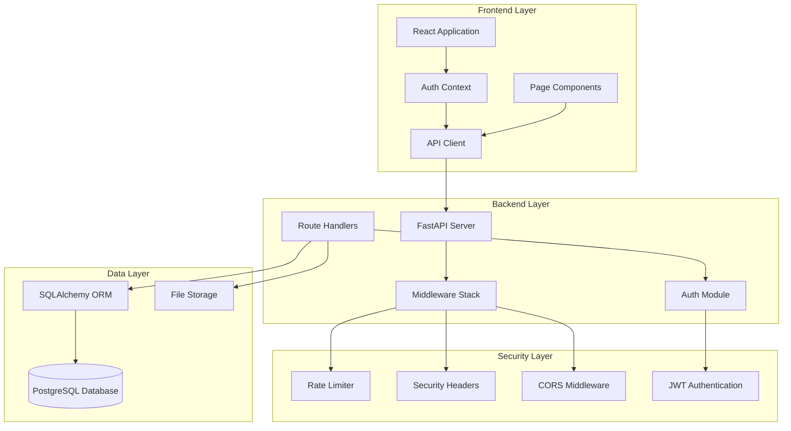

## Database Schema

### Entity Relationships

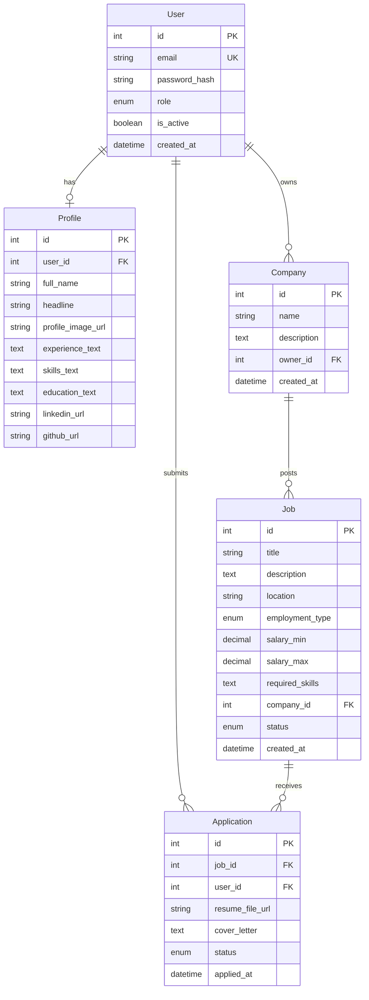

### Enumeration Types

| Enum | Values | Usage |
|------|--------|-------|
| UserRole | admin, employer, seeker | User account type |
| ApplicationStatus | applied, reviewed, rejected, accepted | Application lifecycle state |
| JobStatus | open, closed | Job posting availability |
| EmploymentType | full_time, part_time, contract, internship | Job classification |

## Authentication and Authorization Workflow

### User Registration Flow

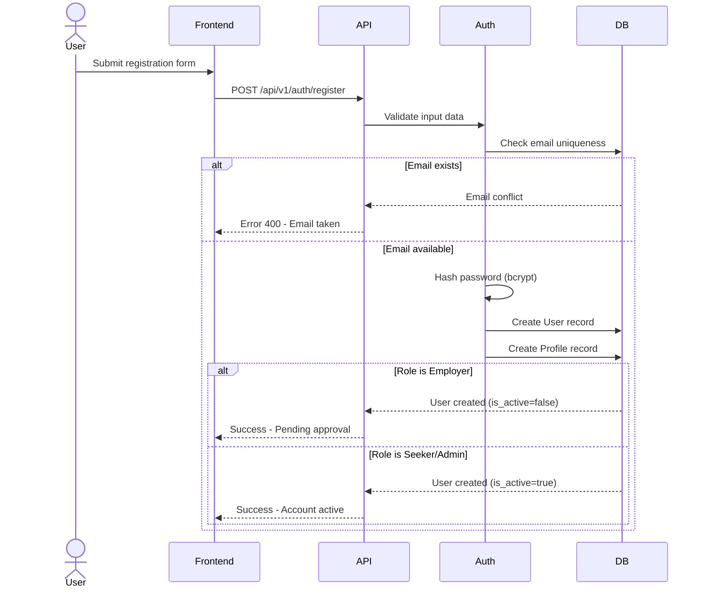

**Key Behaviors:**
- All user types complete registration immediately
- Employers are created with `is_active = false` requiring admin approval
- Job seekers and admins are active immediately
- Profile is auto-created with the user record
- Password is hashed using bcrypt before storage

### Login and Token Flow

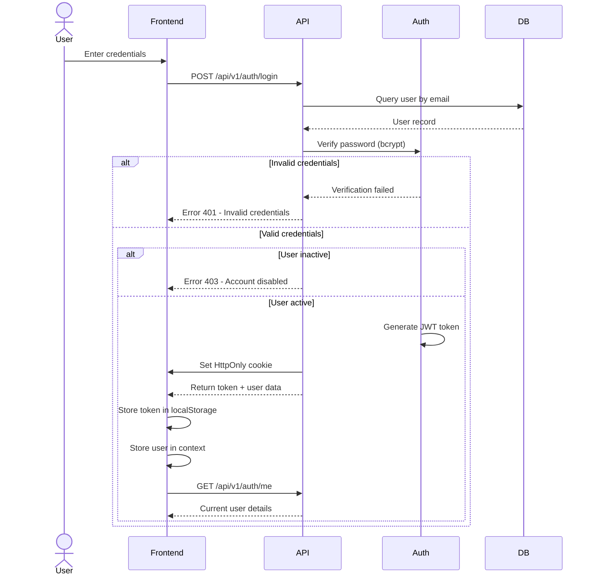

**Security Features:**
- Dual token storage: HttpOnly cookie (XSS protection) + localStorage (API compatibility)
- JWT tokens contain user ID in subject claim
- Token expiration: 24 hours for access tokens, 7 days for refresh tokens
- Failed login does not reveal whether email exists

### Authorization Middleware

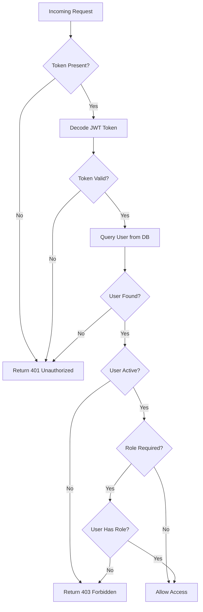

**Dependency Functions:**
- `get_current_user`: Validates token and returns user (any authenticated user)
- `require_admin`: Requires admin role
- `require_employer`: Requires employer or admin role
- `require_seeker`: Requires seeker or admin role

## Core Business Workflows

### Job Seeker Journey

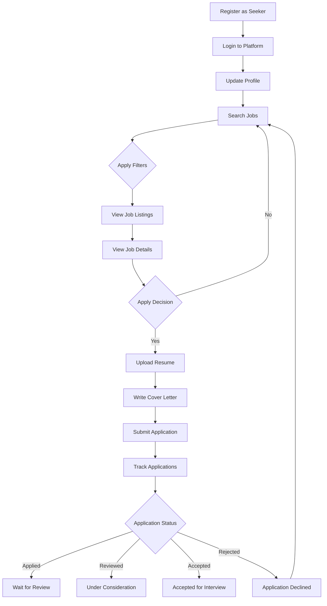

**Key Features:**
- Full-text search across job titles and descriptions
- Advanced filtering: location, employment type, salary range, skills
- Resume upload with validation (PDF, DOC, DOCX, max 5MB)
- Duplicate application prevention
- Real-time application status tracking

### Employer Journey

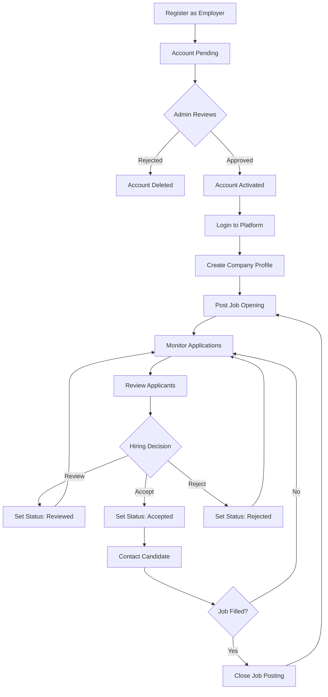

**Key Features:**
- Admin approval required before access
- Multiple companies per employer
- Job posting with rich details (salary, skills, location)
- Application filtering by job
- Resume download and review
- Four-stage application status management

### Admin Management Journey

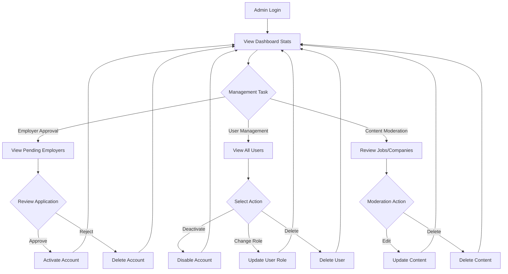

**Key Features:**
- Platform statistics dashboard
- Employer approval queue
- User filtering and search
- Role modification capabilities
- Account activation/deactivation
- Full CRUD access to all entities

## API Module Structure

### Authentication Module (`/api/v1/auth`)

| Endpoint | Method | Purpose | Rate Limited |
|----------|--------|---------|--------------|
| `/register` | POST | Create new user account | Yes |
| `/login` | POST | Authenticate and get token | Yes |
| `/logout` | POST | Clear authentication cookie | No |
| `/me` | GET | Get current user info | No |
| `/password-reset/request` | POST | Request password reset email | Yes |
| `/password-reset/confirm` | POST | Reset password with token | Yes |

### Jobs Module (`/api/v1/jobs`)

| Endpoint | Method | Auth Required | Purpose |
|----------|--------|---------------|---------|
| `/` | POST | Employer/Admin | Create job posting |
| `/` | GET | Public | Search and filter jobs |
| `/{job_id}` | GET | Public | Get job details |
| `/{job_id}` | PUT | Owner/Admin | Update job posting |
| `/{job_id}` | DELETE | Owner/Admin | Delete job posting |

**Search Capabilities:**
- Text search in title and description
- Location partial matching
- Employment type filtering
- Salary range overlap matching
- Skills keyword matching (OR logic)
- Company filtering
- Pagination support

### Applications Module (`/api/v1/applications`)

| Endpoint | Method | Auth Required | Purpose |
|----------|--------|---------------|---------|
| `/jobs/{job_id}/apply` | POST | Seeker | Submit job application |
| `/my-applications` | GET | Seeker | List user's applications |
| `/employer/applications` | GET | Employer/Admin | List received applications |
| `/{application_id}` | GET | Owner/Employer/Admin | View application details |
| `/{application_id}/status` | PUT | Employer/Admin | Update application status |

**Business Rules:**
- One application per user per job
- Only open jobs accept applications
- Resume upload required
- File validation: type and size checks
- Files organized by user ID directories

### Companies Module (`/api/v1/companies`)

| Endpoint | Method | Auth Required | Purpose |
|----------|--------|---------------|---------|
| `/` | POST | Employer/Admin | Create company |
| `/` | GET | Public | List all companies |
| `/my-companies` | GET | Employer/Admin | List owned companies |
| `/{company_id}` | GET | Public | Get company details |
| `/{company_id}` | PUT | Owner/Admin | Update company |
| `/{company_id}` | DELETE | Owner/Admin | Delete company |

**Cascade Behavior:**
- Deleting company deletes all its jobs
- Deleting job deletes all its applications

### Users Module (`/api/v1/users`)

| Endpoint | Method | Auth Required | Purpose |
|----------|--------|---------------|---------|
| `/profile` | GET | Any User | Get own profile |
| `/profile` | PUT | Any User | Update own profile |
| `/profile/{user_id}` | GET | Public | View public profile |

### Admin Module (`/api/v1/admin`)

| Endpoint | Method | Auth Required | Purpose |
|----------|--------|---------------|---------|
| `/users` | GET | Admin | List all users with filters |
| `/users/{user_id}/status` | PUT | Admin | Enable/disable account |
| `/users/{user_id}/role` | PUT | Admin | Change user role |
| `/users/{user_id}` | DELETE | Admin | Delete user account |
| `/pending-employers` | GET | Admin | Get pending approvals |
| `/approve-employer/{user_id}` | POST | Admin | Approve employer |
| `/reject-employer/{user_id}` | DELETE | Admin | Reject employer |
| `/stats` | GET | Admin | Get platform statistics |

**Safety Constraints:**
- Admin cannot disable own account
- Admin cannot change own role
- Admin cannot delete own account

## Frontend Architecture

### Routing Structure

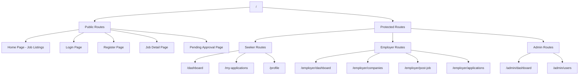

### Component Hierarchy

| Component Type | Examples | Responsibility |
|----------------|----------|----------------|
| Layout | Layout, Navigation | App shell and navigation |
| Context | AuthContext | Global authentication state |
| Pages | HomePage, Dashboard | Full page views |
| Components | Modal, FileUpload, StatusBadge | Reusable UI elements |
| Utilities | errorTracker, API client | Cross-cutting concerns |

### State Management

**Authentication State (Context API):**
- Current user object
- Loading state
- Login/logout functions
- Role checking helpers (isAdmin, isEmployer, isSeeker)

**Local Storage:**
- JWT token for API requests
- User object for quick context restoration

**State Persistence:**
- Token validated on app load via `/auth/me` endpoint
- Invalid tokens trigger automatic logout
- User data refreshed from server

## Security Implementation

### Layer-by-Layer Protection

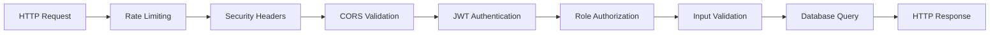

### Security Features

| Layer | Protection | Implementation |
|-------|-----------|----------------|
| Transport | HTTPS enforcement | Secure cookie flags, HSTS headers |
| Input | Validation | Pydantic schemas, file type/size checks |
| Authentication | JWT tokens | HS256 algorithm, 24hr expiration |
| Authorization | Role-based access | Dependency injection guards |
| Session | Secure cookies | HttpOnly, Secure, SameSite flags |
| Rate Limiting | Request throttling | 60 requests/minute default |
| Passwords | Hashing | Bcrypt with automatic salting |
| File Upload | Type & size validation | Whitelist MIME types, 5MB limit |
| Database | SQL injection prevention | ORM parameterized queries |
| XSS | Cookie protection | HttpOnly prevents JS access |
| CSRF | SameSite cookies | Strict SameSite policy |

### Password Reset Security

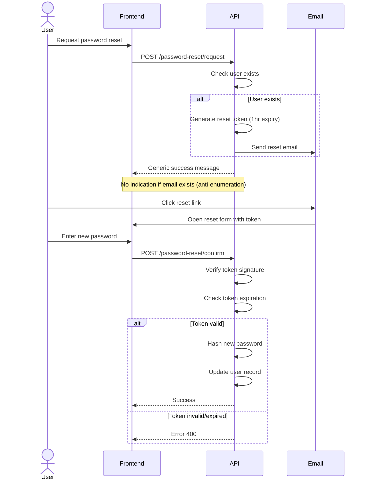

## File Storage System

### Upload Flow

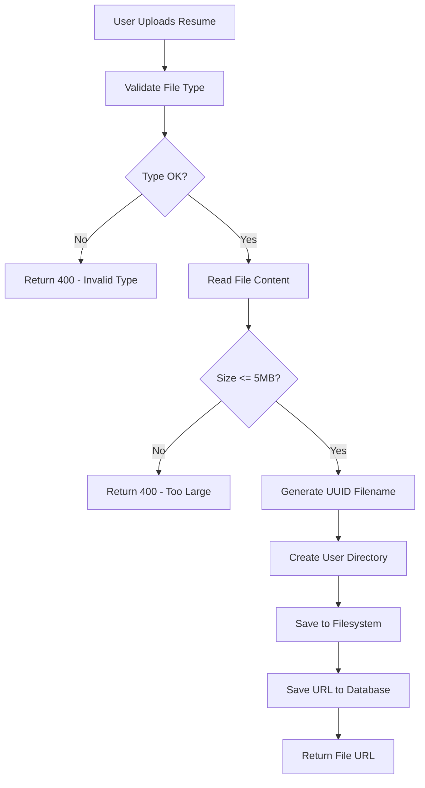

### Directory Structure

```
/app/uploads/
├── {user_id_1}/
│   ├── {user_id_1}_{uuid1}.pdf
│   └── {user_id_1}_{uuid2}.docx
├── {user_id_2}/
│   └── {user_id_2}_{uuid3}.pdf
└── {user_id_3}/
    ├── {user_id_3}_{uuid4}.doc
    └── {user_id_3}_{uuid5}.pdf
```

**File Naming Convention:**
- Format: `{user_id}_{uuid4}{extension}`
- Prevents name collisions
- Maintains file type information
- Enables user-based organization

**Allowed File Types:**
- application/pdf
- application/msword
- application/vnd.openxmlformats-officedocument.wordprocessingml.document

## Middleware Stack

### Request Processing Pipeline

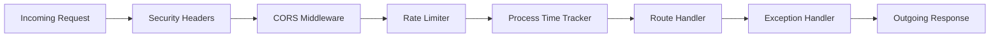

### Middleware Details

**Security Headers Middleware:**
- X-Content-Type-Options: nosniff
- X-Frame-Options: DENY
- X-XSS-Protection: 1; mode=block
- Strict-Transport-Security: max-age=31536000

**CORS Middleware:**
- Configurable allowed origins
- Credentials support enabled
- All methods allowed
- All headers allowed

**Rate Limiter:**
- Default: 60 requests/minute
- Authentication endpoints: stricter limits
- SlowAPI implementation
- Per-IP tracking

**Process Time Header:**
- Adds X-Process-Time to all responses
- Microsecond precision
- Enables performance monitoring

## Health Check System

### Endpoint Structure

| Endpoint | Purpose | Response Detail |
|----------|---------|----------------|
| `/health` | Basic liveness check | Simple status message |
| `/health/detailed` | Comprehensive validation | Full system diagnostics |

### Detailed Health Check Components

The detailed health endpoint validates:
- Database connectivity
- Table existence verification
- Enum value validation
- Seed data verification
- File upload directory accessibility
- API endpoint registration
- Per-component checksums
- Overall system checksum

## Data Validation

### Request Validation (Pydantic Schemas)

All API endpoints use Pydantic models for:
- Type validation
- Required field enforcement
- Format validation (email, URLs)
- Custom validators
- Automatic API documentation

**Example Validation Rules:**
- Email must be valid format
- Passwords minimum 8 characters
- Salary min cannot exceed salary max
- Resume file size limited to 5MB
- Cover letter max 5000 characters

### Database Constraints

| Constraint Type | Examples |
|----------------|----------|
| Primary Keys | Auto-incrementing integers |
| Foreign Keys | CASCADE deletion configured |
| Unique Constraints | Email addresses |
| Not Null | Required fields enforced |
| Indexes | Email, job status, employment type, location |
| Enums | Role, status fields |

## Error Handling Strategy

### Error Response Structure

All errors return consistent JSON format:

| Field | Type | Purpose |
|-------|------|---------|
| detail | string | Human-readable error message |
| error_type | string | Exception type (debug mode only) |

### HTTP Status Code Usage

| Code | Usage |
|------|-------|
| 200 OK | Successful GET requests |
| 201 Created | Successful POST creating resource |
| 204 No Content | Successful DELETE requests |
| 400 Bad Request | Validation errors, business rule violations |
| 401 Unauthorized | Missing or invalid authentication |
| 403 Forbidden | Authenticated but insufficient permissions |
| 404 Not Found | Resource does not exist |
| 500 Internal Server Error | Unexpected server errors |

### Global Exception Handler

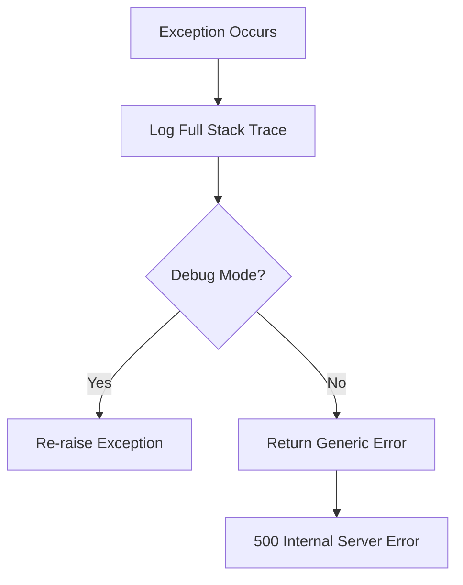

**Behavior:**
- All exceptions logged with full traceback
- Debug mode shows detailed errors
- Production mode returns generic message
- Prevents information leakage

## Performance Optimizations

### Database Connection Pooling

| Parameter | Value | Purpose |
|-----------|-------|---------|
| pool_size | 20 | Concurrent connections |
| max_overflow | 40 | Additional connections under load |
| pool_recycle | 3600 | Connection refresh (1 hour) |
| pool_timeout | 30 | Wait time for connection |
| pool_pre_ping | True | Verify connection before use |

### Query Optimizations

- Indexed columns: email, job status, employment type, location
- Eager loading for relationships using joins
- Pagination on all list endpoints
- Selective field loading

### Caching Strategy

- Cache invalidation on company create/update/delete
- Strategic cache keys for common queries
- In-memory caching implementation

## Deployment Considerations

### Environment Configuration

All configuration via environment variables:
- Database connection strings
- Secret keys for JWT
- CORS origins
- File upload settings
- Email SMTP configuration
- Rate limiting parameters
- Logging levels

### Critical Production Settings

| Setting | Development | Production |
|---------|-------------|------------|
| DEBUG | True | False |
| SECRET_KEY | Any value | 64+ char random |
| SESSION_COOKIE_SECURE | False | True (requires HTTPS) |
| CORS_ORIGINS | localhost:3000 | Production domain |
| DATABASE_URL | Local PostgreSQL | Production database |

### Startup Validation

On application start:
- Security configuration validation
- Warning logs for insecure settings
- Database connection verification
- Upload directory creation

## System Integration Points

### Frontend-Backend Communication

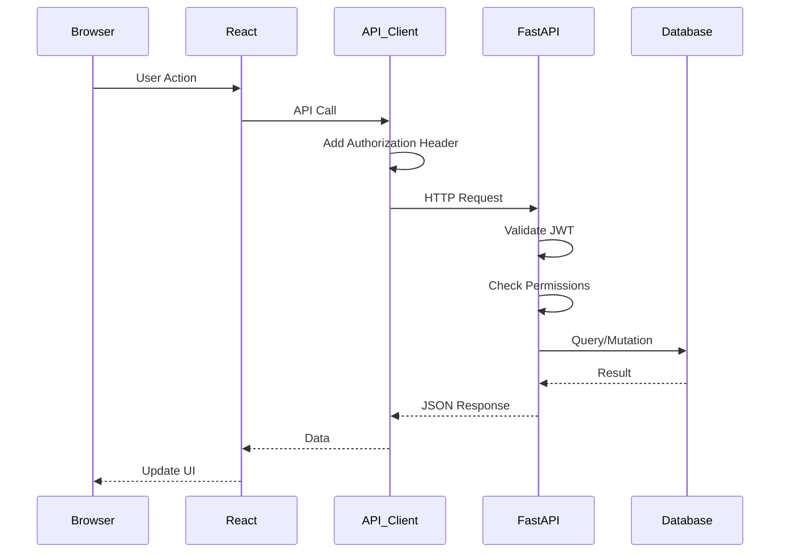

### API Client Configuration

- Base URL configured per environment
- Automatic token injection
- Request/response interceptors
- Error handling and retry logic
- Cookie support for authentication

## Key Business Rules

### User Management
- Employers require admin approval before activation
- Users cannot apply to same job multiple times
- Profile automatically created with user account
- Email addresses must be unique across platform

### Job Posting
- Only active employers can post jobs
- Employers can only post for their own companies
- Jobs default to "open" status
- Admins have full access to all jobs

### Application Process
- Only job seekers can submit applications
- Resume upload mandatory for all applications
- Applications only accepted for open jobs
- Employers can only manage applications for their jobs

### Data Deletion
- User deletion cascades to profile, companies, applications
- Company deletion cascades to jobs and applications
- Job deletion cascades to applications
- Admins protected from self-deletion

### Authorization Hierarchy
- Admins have full access to all operations
- Employers can view as seekers (dual permissions)
- Seekers have limited access to own data
- Resource owners can manage their own resources

- Employers can view as seekers (dual permissions)
- Seekers have limited access to own data
- Resource owners can manage their own resources

- Employers can view as seekers (dual permissions)
- Seekers have limited access to own data
- Resource owners can manage their own resources

